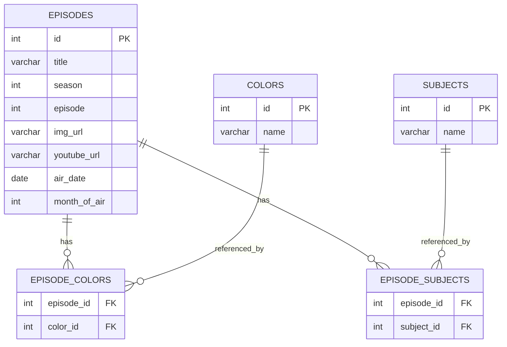
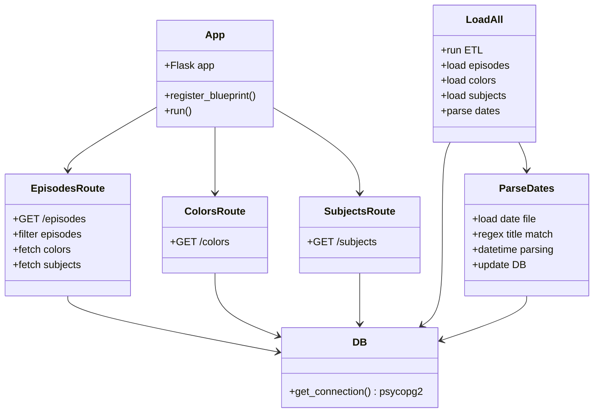
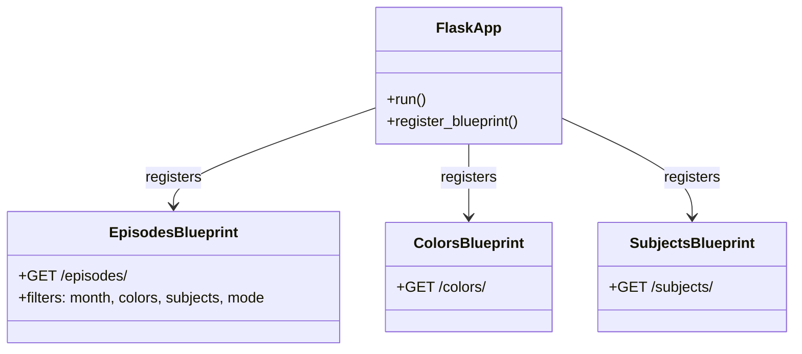

# Bob Ross API project

## Using different languages to work together to modify, transfer, and save things to database.

Solving problem using ETL (Extract, Transform, Load)
which is the process of taking data from many unique sources, modify in some way, and store it in centralized database.

Common Practice when collecting data from sysytems to utilize that data in another system. Could be CSV, JSON, XML, and API requests, etc.

Will build up README as I read thru the project and add pictures and examples.

# The Joy of Painting API

## Author: Taylor Poe

A small Flask + PostgreSQL API that exposes structured metadata for **Bob Ross – The Joy of Painting**, including episode titles, air dates, seasons, palettes, and subjects. Everything is loaded into PostgreSQL using lightweight ETL scripts, and the API returns clean JSON for easy consumption.

---

## Project Structure

```text
.
├── api/
│   ├── app.py
│   ├── db.py
│   └── routes/
│       ├── episodes.py
│       ├── colors.py
│       └── subjects.py
├── scripts/
│   ├── load_all.py
│   └── parse_dates.py
├── data/
│   └── TJOP-Episode_Dates.txt
├── sql/
│   └── create_db.sql
└── README.md
```

## Key Technologies & Imports

**Flask – API server & routing**

`from flask import Flask, Blueprint, request, jsonify` 

**psycopg2 – PostgreSQL connection**

`import psycopg2` 

**Datetime & Regex – parsing episode dates**

`from datetime import datetime import re` 

**Typing (optional, used throughout)**

`from typing import  Any, List, Optional` 

----------

## Requirements

-   Python 3.x
    
-   PostgreSQL installed (with `psql`, `createdb`, etc.)
    
-   Recommended: Python virtual environment
    

Install dependencies:
```
pip3 install flask psycopg2-binary
```
```
pip3 install -r requirements.txt
```

----------

## Running the Project Locally (Step-by-Step)

All commands run from the project root.

### 1. Make sure the database exists

`createdb the_joy_of_painting` 

(If it already exists, the error is fine — move on.)

### 2. Create all tables

This drops/recreates all required tables.

`psql the_joy_of_painting < sql/create_db.sql` 

### 3. Run the ETL process

Loads episodes, colors, subjects, and parses all air dates.

`python3 scripts/load_all.py` 

Expected output:

`Starting ETL
ETL completed successfully` 

(Unmatched titles will be printed for debugging.)

### 4. Start the Flask API

`python3 api/app.py` 

Server will start at:

`http://127.0.0.1:5000` 

----------

## API Endpoints

### Get all episodes

`GET /episodes/` 

Example response:
```
{  
	"id":  1,
	"title":  "A Walk In The Woods",
	"season":  1,
	"episode":  1,
	"img_url": "https://www.twoinchbrush.com/images/painting282.webp",
	"youtube_url": "https://www.youtube.com/embed/oh5p5f5_-7A",
	"air_date":  "Tue, 11 Jan 1983 00:00:00 GMT",
	"month_of_air":  1,
	"colors":  ["Alizarin Crimson",
	"Titanium White"],
	"subjects":  ["tree",  "river",  "grass"]
}
```

----------

## Filtering Episodes

Endpoint:

`GET /episodes/` 

### Query Params

Param

Description

`month`

Integer 1–12

`colors`

Comma-separated list of colors

`subjects`

Comma-separated list of subjects

`mode`

`all` (AND logic) or `any` (OR logic)

### Examples

Episodes airing in January:

`curl "http://127.0.0.1:5000/episodes/?month=1"` 

Episodes containing Prussian Blue + Sap Green:

`curl "http://127.0.0.1:5000/episodes/?colors=Prussian%20Blue,Sap%20Green"` 

Episodes with tree subjects in January requiring **all** conditions:

`curl "http://127.0.0.1:5000/episodes/?subjects=tree&month=1&mode=all"` 

Episodes matching **either** month OR subject:

`curl "http://127.0.0.1:5000/episodes/?subjects=tree&month=1&mode=any"` 

----------

## Colors

`GET /colors/` 

Returns all available colors.

----------

## Subjects

`GET /subjects/` 

Returns all subjects parsed across the dataset.

----------

## Testing Locally

### 1. Using curl

All episodes:

`curl http://127.0.0.1:5000/episodes/` 

Filtered example:

`curl "http://127.0.0.1:5000/episodes/?subjects=mountain&colors=Prussian%20Blue"` 

Colors:

`curl http://127.0.0.1:5000/colors/` 

Subjects:

`curl http://127.0.0.1:5000/subjects/` 

### 2. Sanity-check the database

Open PostgreSQL:

`psql the_joy_of_painting` 

Run:

`SELECT id, title, season, episode, air_date, month_of_air FROM episodes
LIMIT 10;` 

Verify:

-   Air dates are filled
    
-   `month_of_air` matches the air date
    
-   Titles match API output
    

----------

## Component Overview (Quick Notes)

### `api/app.py`

-   Creates the Flask app
    
-   Registers all blueprints
    

### `api/db.py`

-   Exposes `get_connection()` using psycopg2
    

### `api/routes/episodes.py`

-   Implements `/episodes`
    
-   Handles filtering (month, colors, subjects, mode)
    
-   Joins color + subject tables
    

### `api/routes/colors.py`

-   Simple `GET /colors/`
    

### `api/routes/subjects.py`

-   Simple `GET /subjects/`
    

### `scripts/load_all.py`

-   Runs the full ETL
    
-   Loads data + triggers date parsing
    

### `scripts/parse_dates.py`

-   Reads `TJOP-Episode_Dates.txt`
    
-   Extracts `"Title" (Month Day, Year)` using regex
    
-   Updates `air_date` + `month_of_air` in DB
    

----------

## Quick Run Cheat Sheet
```
psql the_joy_of_painting < sql/create_db.sql
python3 scripts/load_all.py
python3 api/app.py
```

Then open:

`http://127.0.0.1:5000/episodes/` 

## UML diagrams







